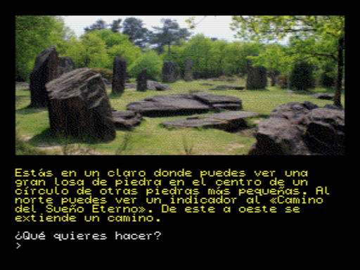

#**MSX2DAAD**

This project is a **DAAD** interpreter created from scratch for **MSX2**/**MSX2+** systems and using the graphical capabilities of this machines.

**DAAD** is a multi-machine and multi-graphics adventure writer, enabling you to target a broad range of 8-bit and 16-bit systems.

You can see the classic interpreters [here](https://github.com/daad-adventure-writer/daad).

**MSX2DAAD** is also compatible with [Maluva DAAD extension](https://github.com/Utodev/MALUVA), that add new functionalities to the classic interpreters like:

- Load bitmap images from disk.
- Load/Save the game from/to disk.
- Use of external texts in a disk file providing 64kb of additional compressed texts.

 

***

###Supported languages

- English
- Spanish

***

###MSX graphical modes

####**Screen 5**

- 256x212 16 colors (Paletted GRB332)
- Color 0: Always PAPER (default: black)
- Color 1-14: For bitmap images
- Color 15: Always INK (default: white)
- INK/PAPER color changes will change the 0/15 color palette for all the text/background.
		
####**Screen 6**

- 512x212 4 colors  (Paletted GRB332)
- Color 0: Always PAPER (default: black)
- Color 1-2: For bitmap images
- Color 3: Always INK (default: white)
- INK/PAPER color changes will change the 0/3 color palette for all the text/background.

####**Screen 7**

- 512x212 16 colors (Paletted GRB332)
- Color 0: Always PAPER (default: black)
- Color 1-14: For bitmap images
- Color 15: Always INK (default: white)
- INK/PAPER color changes will change the 0/15 color palette for all the text/background.

###**Screen 8**

- 256x212 256 colors (fixed palette GRB332) **[*DEFAULT MODE*]**
- Bitmap mode with fixed palette (0-255)
- INK/PAPER color changes will change color of writed new text or when clear screen. Old text remains unchanged.

###**Screen 12**
- 256x212 19268 colors (fixed palette YJK. Y vary each pixel, J & K remains each 4 pixels providing something like ~RGB555)
- Bitmap mode with fixed palette (0-19268)
- INK/PAPER color changes don't have effect. INK is always white and PAPER is always black.

***

###Aditional tools in /bin folder

####**imgwizard.php**
A tool to convert SC5, SC6, SC7, SC8 and SCC images to the **msx2daad** and compressed format.
The compression can be: **raw** (no compression), **rle**, or **pletter** (needs pletter executable in the path).

####**precomp.php**
Read a *DDB* adventure file and generates the file */src/daad_defines.h* with a list of condacts not used in the input adventure file.
If after that you do a clean compilation, you will obtain a thin **msx2daad** executable.

####**testdaad.c**
A command line program for testing your adventures using a text file with the commands and the expected texts in return. You need **openMSX** emulator configured and in the path.
**testdaad** can be compiled with GCC/MinGW.

	#
	# Example of testing input file
	# msx2daad.com must be compiled with -DTEST
	#
	# > is used to send commands
	# < is used to expect output texts
	#
	> go north
	< bad direction
	> go east
	< bad direction
	> take sword
	< you have now a sword

***

###External tools

####**Online MSX Screen Converter (jannone)**
You can use this page to convert yours original pictures to MSX format.
Palette files are not generated and must be done handmade, but *screen 8* and *screen 12* files can be generated easily.
http://msx.jannone.org/conv/

####**MSXViewer5 Screen Converter (MarMSX)**
A powerful tool to convert pictures to MSX formats. Versions for Linux and Windows.
You can export image and palette files.
http://marmsx.msxall.com/msxvw/msxvw5/index_en.php

